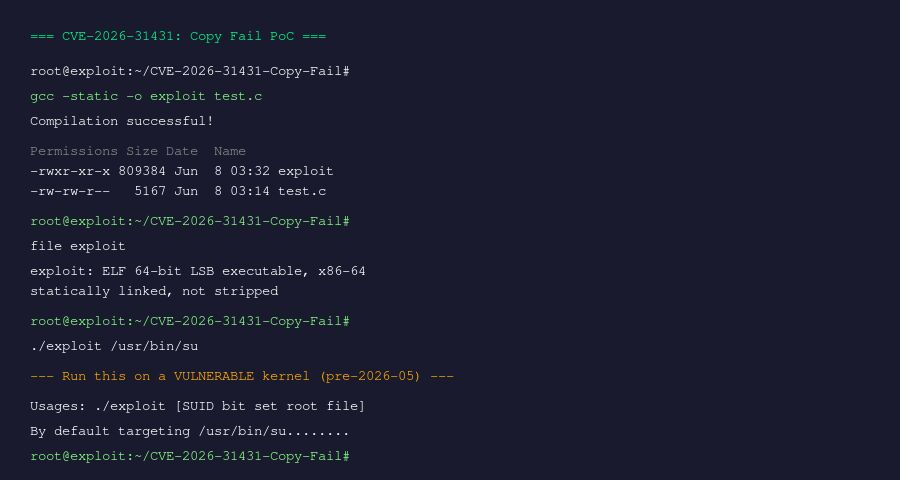

# CVE-2026-31431: Copy Fail — Local Privilege Escalation PoC

> **Recreated PoC by Rahul Razz**  
> Original discovery by Taeyang Lee, Theori & Xint Code Research Team

A recreated Proof-of-Concept for **CVE-2026-31431 ("Copy Fail")**, a Linux kernel vulnerability that allows an unprivileged user to perform a deterministic **4-byte write** into the **page cache** of any readable file via `AF_ALG` + `splice()`.



## Vulnerability Overview

The bug is a logic flaw in the kernel's `authencesn` cryptographic template (a variant of the AEAD `authenc` that does extended sequence number rearranging). During decryption, `authencesn` writes the ESN bytes at `dst[assoclen + cryptlen]` — a location beyond the ciphertext buffer that happens to land in the **page cache** of the target file when using `splice()` + `AF_ALG`.

| CVE | CVSS | Affected Kernels |
|:---|:---:|:---|
| CVE-2026-31431 | 7.8 High | Linux since ~2017 (commit 72548b093ee3) |

## Requirements

- **Linux kernel** built between commits `72548b093ee3` and `a664bf3d603d` (approximately 2017 – May 2026)
- A readable **SUID root binary** (default: `/usr/bin/su`)
- `CONFIG_CRYPTO_USER_API_SKCIPHER` and `CONFIG_CRYPTO_MANAGER` enabled (default on most distros)
- `gcc` with standard build tools

## How It Works

1. Opens an **AF_ALG socket** bound to `authencesn(hmac(sha256),cbc(aes))`
2. Opens the target SUID binary read-only → kernel loads it into the **page cache**
3. For each 4-byte chunk of shellcode:
   - Constructs an **AAD** containing shellcode bytes
   - Calls `sendmsg(MSG_MORE)` → triggers AEAD decryption in the kernel
   - Uses **`splice()`** to feed the decryption output back through a pipe
   - The 4-byte ESN write lands at the correct offset in the page cache
4. After all shellcode is written, calls `execl()` on the corrupted SUID binary → **root shell**

## Compilation

```bash
gcc -static -o exploit test.c
```

> **Note**: Static linking is required because the target SUID binary gets corrupted and the dynamic linker may fail.

## Usage

```bash
# Default target: /usr/bin/su
./exploit

# Custom target
./exploit /usr/bin/pkexec
```

## Expected Output

On a vulnerable kernel, the exploit will:
1. Compile silently
2. Run and overwrite the first 192 bytes of the target SUID binary with shellcode
3. Execute the corrupted binary → spawns a **root shell**

## References

- [retr0.zip Blog — Copy Fail](https://retr0.zip/blog/cve-2026-31431-copy-fail.html)
- [Xint Code Research Team](https://xint.dev/blog/copy-fail)
- [Copy Fail Official Page](https://copy.fail/)
- [NVD Entry](https://nvd.nist.gov/vuln/detail/CVE-2026-31431)
- [Full Writeup by Rahul Razz](https://razz.systems/posts/binary-exploitation/cve-2026-31431-copy-fail/)

## License

This PoC is provided for educational and research purposes only.
